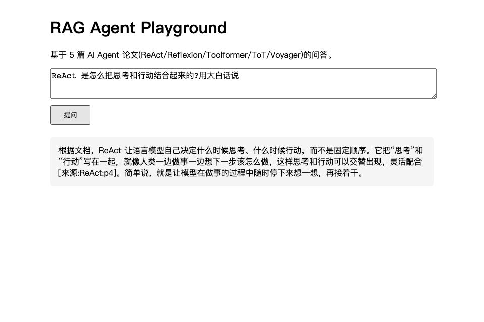

# RAG Agent Showcase

[](https://github.com/Joe-rq/rag-agent-showcase/actions/workflows/test.yml) [![zread](https://img.shields.io/badge/Ask_Zread-_.svg?style=flat&color=00b0aa&labelColor=000000&logo=data%3Aimage%2Fsvg%2Bxml%3Bbase64%2CPHN2ZyB3aWR0aD0iMTYiIGhlaWdodD0iMTYiIHZpZXdCb3g9IjAgMCAxNiAxNiIgZmlsbD0ibm9uZSIgeG1sbnM9Imh0dHA6Ly93d3cudzMub3JnLzIwMDAvc3ZnIj4KPHBhdGggZD0iTTQuOTYxNTYgMS42MDAxSDIuMjQxNTZDMS44ODgxIDEuNjAwMSAxLjYwMTU2IDEuODg2NjQgMS42MDE1NiAyLjI0MDFWNC45NjAxQzEuNjAxNTYgNS4zMTM1NiAxLjg4ODEgNS42MDAxIDIuMjQxNTYgNS42MDAxSDQuOTYxNTZDNS4zMTUwMiA1LjYwMDEgNS42MDE1NiA1LjMxMzU2IDUuNjAxNTYgNC45NjAxVjIuMjQwMUM1LjYwMTU2IDEuODg2NjQgNS4zMTUwMiAxLjYwMDEgNC45NjE1NiAxLjYwMDFaIiBmaWxsPSIjZmZmIi8%2BCjxwYXRoIGQ9Ik00Ljk2MTU2IDEwLjM5OTlIMi4yNDE1NkMxLjg4ODEgMTAuMzk5OSAxLjYwMTU2IDEwLjY4NjQgMS42MDE1NiAxMS4wMzk5VjEzLjc1OTlDMS42MDE1NiAxNC4xMTM0IDEuODg4MSAxNC4zOTk5IDIuMjQxNTYgMTQuMzk5OUg0Ljk2MTU2QzUuMzE1MDIgMTQuMzk5OSA1LjYwMTU2IDE0LjExMzQgNS42MDE1NiAxMy43NTk5VjExLjAzOTlDNS42MDE1NiAxMC42ODY0IDUuMzE1MDIgMTAuMzk5OSA0Ljk2MTU2IDEwLjM5OTlaIiBmaWxsPSIjZmZmIi8%2BCjxwYXRoIGQ9Ik0xMy43NTg0IDEuNjAwMUgxMS4wMzg0QzEwLjY4NSAxLjYwMDEgMTAuMzk4NCAxLjg4NjY0IDEwLjM5ODQgMi4yNDAxVjQuOTYwMUMxMC4zOTg0IDUuMzEzNTYgMTAuNjg1IDUuNjAwMSAxMS4wMzg0IDUuNjAwMUgxMy43NTg0QzE0LjExMTkgNS42MDAxIDE0LjM5ODQgNS4zMTM1NiAxNC4zOTg0IDQuOTYwMVYyLjI0MDFDMTQuMzk4NCAxLjg4NjY0IDE0LjExMTkgMS42MDAxIDEzLjc1ODQgMS42MDAxWiIgZmlsbD0iI2ZmZiIvPgo8cGF0aCBkPSJNNCAxMkwxMiA0TDQgMTJaIiBmaWxsPSIjZmZmIi8%2BCjxwYXRoIGQ9Ik00IDEyTDEyIDQiIHN0cm9rZT0iI2ZmZiIgc3Ryb2tlLXdpZHRoPSIxLjUiIHN0cm9rZS1saW5lY2FwPSJyb3VuZCIvPgo8L3N2Zz4K&logoColor=ffffff)](https://zread.ai/Joe-rq/rag-agent-showcase)

基于 LangChain 的检索增强生成(RAG)智能体 -- 全链路自实现的独立工程案例: 数据接入、chunking、向量检索、HyDE 进阶检索、Ragas 四指标评估、FastAPI 服务化。

## 关键设计决策

| 维度 | 选择 | 理由 |
|---|---|---|
| 模型后端 | Embedding 本地 42model + LLM 云端 DeepSeek | embedding 本地零计费, LLM 云端快稳, 两端 OpenAI 兼容可切换 |
| 数据集 | 5 篇 AI Agent 论文固定冻结(ReAct/Reflexion/Toolformer/ToT/Voyager) | 可复现、可对比 |
| Chunking | recursive(800/120), 保留 fixed/markdown 变体对比 | 多级分隔符保语义, 评估驱动选型 |
| 检索 | HyDE 假设文档嵌入 | 对齐 query-document 语义, 提升检索精度 |
| 评估 | Ragas 四指标 + 20 QA + baseline 对比 | 专业化, 量化 HyDE 增益 |
| 服务 | FastAPI(弃用已废弃的 LangServe) | 跟进技术趋势, 路由透明 |

## 架构

```
[论文 PDF] -> pymupdf 解析 -> chunking -> [qwen3-embedding] -> FAISS 索引
                                                            |
问 question -> [HyDE: LLM 生成假设文档] -> 检索 top-k -> 拼上下文 -> [DeepSeek] -> answer
```

## Demo



`uv run uvicorn app.main:app --port 8000` 后打开 http://localhost:8000/playground 交互问答。

## 技术栈

- **LangChain 0.3** -- LCEL 链式编排
- **FAISS** -- 向量检索
- **Ragas** -- RAG 评估
- **42model** -- 本地 embedding 后端(OpenAI 兼容, 离线零计费)
- **DeepSeek** -- 云端 LLM(OpenAI 兼容)
- **FastAPI** -- 服务化
- **uv** -- 依赖管理

## 快速开始

前置: 已装 [42model](https://42model.com/)(`42model abilities` 显示有 `qwen3-embedding:0.6b`),且有云端 LLM API key(默认 DeepSeek)。

```bash
# 1. 启动 42model 本地 embedding 后端(后台常驻)
42model serve --port 11520 -y &

# 2. 安装依赖
uv sync

# 3. 配置(填 LLM_API_KEY, 默认 DeepSeek)
cp .env.example .env

# 4. 构建索引(首次会下载 5 篇论文)
uv run python -m rag_agent.indexing

# 5. 冒烟测试(端到端跑通)
uv run python verify.py

# 6. 评估
uv run python -m rag_agent.eval

# 7. 启动服务
uv run uvicorn app.main:app --port 8000
```

## 项目结构

```
rag-agent-showcase/
├── src/rag_agent/
│   ├── config.py      # 配置加载(yaml + env)
│   ├── models.py      # 模型工厂(LLM / embedder)
│   ├── indexing.py    # 数据加载 + chunking + FAISS
│   ├── retrieval.py   # 检索 + HyDE
│   ├── chain.py       # RAG LCEL 链
│   └── eval.py        # Ragas 评估
├── app/main.py        # FastAPI 服务
├── data/              # 论文 PDF + FAISS 索引(gitignore)
├── evals/             # QA 集 + 评估结果
├── docs/
│   ├── adr/           # 选型决策记录
│   └── evaluation-report.md
├── config.yaml        # 全配置
└── pyproject.toml
```

## 评估结果

双场景 20 QA 验证 HyDE 适用性(Ragas 四指标, 详见 [docs/evaluation-report.md](docs/evaluation-report.md)):

| 场景 | context_precision Δ | context_recall Δ | 结论 |
|---|---|---|---|
| 论文式 QA(query≈document) | -0.033 | -0.002 | HyDE 无增益(场景不匹配) |
| 口语化 QA(query≠document) | **+0.026** | **+0.025** | HyDE 检索正向(适用此场景) |

**结论: HyDE 的价值取决于 query-document 表达差异**——口语化提问时检索精度/召回提升, 论文式提问时无用武之地。这验证了"进阶检索要看场景匹配", 而非"HyDE 万能"。

## 已知局限

1. **judge = generator**: 评估 judge 与生成模型同为 DeepSeek, 存在自评偏差。更严谨的做法是用更强且不同的模型(如 GPT-4)做 judge。
2. **QA 自动合成**: 20 个 QA 由 LLM 合成, 质量受 LLM 限制, 可能偏简单/偏难, 影响 context_precision/recall 区分度。
3. **LLM 依赖云端 key**: DeepSeek 需 API key, 非"完全本地"。embedding 已本地化(42model)。
